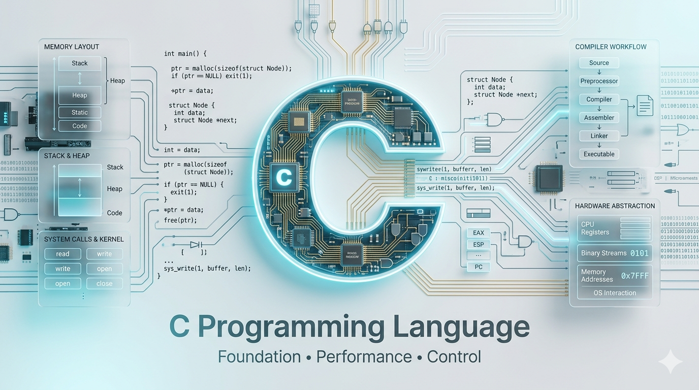

<div align="center">



<h1>⚡ C Programming — From Basics to Mastery</h1>

<p><b>Code • Logic • Implementation</b></p>

<p><i>Master C with deep understanding of logic, memory, and performance.</i></p>

<br/>

<p>
  
  
  
  
  
</p>

</div>

---

## 🚀 Introduction

**C** is a general-purpose, procedural programming language developed by Dennis Ritchie at Bell Labs in 1972. It remains one of the most influential languages ever created — the foundation of operating systems, embedded systems, and modern programming languages.

**Why learn C?**

- It teaches you *how computers actually work* — memory, pointers, hardware interaction
- Every major language (Python, Java, C++, Rust) borrows concepts from C
- Essential for systems programming, OS development, and embedded engineering
- Sharpens your problem-solving and logical thinking like no other language

**Real-world importance:**

- Linux kernel, Windows NT, macOS core — all written in C
- Embedded systems, IoT devices, microcontrollers run C
- High-performance applications demand C-level control
- Competitive programming and interview prep rely heavily on C fundamentals

---

## 🎯 Learning Goals

<div align="center">

<table>
<tr>
<td align="center" width="25%">
<br/><br/>
Variables, data types, operators, control flow — rock solid
</td>
<td align="center" width="25%">
<br/><br/>
Stack, heap, malloc, calloc, free — zero leaks
</td>
<td align="center" width="25%">
<br/><br/>
Logic-first thinking with real coding challenges
</td>
<td align="center" width="25%">
<br/><br/>
Pointers, file I/O, process memory — how it all connects
</td>
</tr>
</table>

</div>

---

## 📚 Complete Roadmap

<div align="center">

<table>
<tr>
<td align="center"></td>
<td><b>Variables, Data Types, I/O, Operators</b></td>
<td align="center">🟢 Start Here</td>
</tr>
<tr>
<td align="center"></td>
<td><b>if/else, switch, ternary</b></td>
<td align="center">🟢 Core Logic</td>
</tr>
<tr>
<td align="center"></td>
<td><b>for, while, do-while, break, continue</b></td>
<td align="center">🟢 Iteration</td>
</tr>
<tr>
<td align="center"></td>
<td><b>Declaration, definition, scope, recursion</b></td>
<td align="center">🟡 Modular Code</td>
</tr>
<tr>
<td align="center"></td>
<td><b>1D/2D arrays, string functions, manipulation</b></td>
<td align="center">🟡 Data Handling</td>
</tr>
<tr>
<td align="center"></td>
<td><b>Address, dereferencing, pointer arithmetic, double pointers</b></td>
<td align="center">🔴 Critical</td>
</tr>
<tr>
<td align="center"></td>
<td><b>struct, union, typedef, nested structs</b></td>
<td align="center">🟡 Custom Types</td>
</tr>
<tr>
<td align="center"></td>
<td><b>fopen, fread, fwrite, fclose, modes</b></td>
<td align="center">🟡 Persistence</td>
</tr>
<tr>
<td align="center"></td>
<td><b>malloc, calloc, realloc, free, memory leaks</b></td>
<td align="center">🔴 Advanced</td>
</tr>
<tr>
<td align="center"></td>
<td><b>Linked List, Stack, Queue, Trees</b></td>
<td align="center">🔴 Mastery</td>
</tr>
</table>

</div>

---

## 📂 Folder Structure

```
buildInC/
├── assets/
│   └── C.png
├── Chapter_1/               # Basics — Variables, Data Types, I/O, Operators
├── Chapter_2/               # Control Flow — if/else, switch, ternary
├── Chapter_3/               # Loops — for, while, do-while, break, continue
├── Chapter_4/               # Functions — Declaration, scope, recursion
├── Chapter_5/               # Arrays & Strings
├── Chapter_6/               # Pointers — Address, arithmetic, double pointers
├── Chapter_7/               # Structures — struct, union, typedef
├── Chapter_8/               # File Handling — fopen, fread, fwrite
├── Chapter_9/               # Memory Allocation — malloc, calloc, realloc, free
├── Chapter_10/              # Data Structures — Linked List, Stack, Queue, Tree
├── Chapter_11/              # Advanced — Mixed problems & interview prep
├── .gitignore
├── C_Handbook.pdf
├── LICENSE
└── README.md
```

> 📁 Each chapter folder will be populated with `.c` source files as the module is completed — following the roadmap above.

---

## 💡 Concepts Covered

<table>
<tr>
<td width="50%">

**Core Concepts**
- 📌 Variables & Data Types (`int`, `float`, `char`, `double`)
- 📌 Operators (arithmetic, logical, bitwise, relational)
- 📌 Conditionals (`if`, `else if`, `switch`)
- 📌 Loops (`for`, `while`, `do-while`)
- 📌 Functions (parameters, return types, scope)
- 📌 Recursion (base case, call stack, backtracking)

</td>
<td width="50%">

**Advanced Concepts**
- 🔴 **Pointers** — the heart of C (address, deref, arithmetic)
- 🔴 **Memory Allocation** — `malloc`, `calloc`, `realloc`, `free`
- 📌 Structures & Unions (custom data types)
- 📌 File Handling (read, write, append, binary)
- 📌 Strings (char arrays, `string.h` functions)
- 📌 Data Structures (Linked List, Stack, Queue, Tree)

</td>
</tr>
</table>

> 🔴 **Pointers** deserve special attention — they are what separates a C beginner from a C programmer. Every pointer concept here is explained with diagrams, logic, and code.

---

## 🧠 Code + Logic Approach

<div align="center">

Every concept follows a strict 5-step learning pattern — no shortcuts.

<br/>


&nbsp;→&nbsp;

&nbsp;→&nbsp;

&nbsp;→&nbsp;

&nbsp;→&nbsp;


<br/><br/>

<table>
<tr>
<td align="center" width="20%"><b>📖 Concept</b></td>
<td align="center" width="20%"><b>🧠 Logic</b></td>
<td align="center" width="20%"><b>💻 Code</b></td>
<td align="center" width="20%"><b>⚠️ Edge Cases</b></td>
<td align="center" width="20%"><b>✅ Best Practices</b></td>
</tr>
<tr>
<td align="center">Understand <i>what</i> it is and <i>why</i> it exists</td>
<td align="center">Mental model — think before you type</td>
<td align="center">Clean, minimal, well-commented C code</td>
<td align="center">Null pointers, overflow, empty input</td>
<td align="center">Memory safety, naming, undefined behavior</td>
</tr>
</table>

</div>

---

## ⚙️ Setup & Run Code

**Prerequisites:** GCC compiler installed on your system.

```bash
# Install GCC (macOS)
brew install gcc

# Install GCC (Ubuntu/Debian)
sudo apt install gcc

# Verify installation
gcc --version
```

**Compile and run any program:**

```bash
# Compile
gcc program.c -o program

# Run
./program

# Compile with warnings (recommended)
gcc -Wall -Wextra program.c -o program
```

**Example — Hello World:**

```c
#include <stdio.h>

int main() {
    printf("Hello, C World!\n");
    return 0;
}
```

```bash
gcc hello_world.c -o hello_world
./hello_world
# Output: Hello, C World!
```

---

## 📊 Progress Tracker

*Fork this repo and check off topics as you complete them.*

</div>

<table>
<tr>
<td valign="top" width="50%">

**📦 Fundamentals**
- [ ] Hello World & Basic I/O
- [ ] Variables & Data Types
- [ ] Operators & Expressions
- [ ] Type Casting

**🔀 Control Flow**
- [ ] if / else if / else
- [ ] switch / case
- [ ] Ternary Operator

**🔁 Loops**
- [ ] for loop
- [ ] while loop
- [ ] do-while loop
- [ ] break & continue
- [ ] Nested loops & patterns

**🧩 Functions**
- [ ] Declaration & definition
- [ ] Pass by value
- [ ] Recursion
- [ ] Scope & lifetime

**📐 Arrays & Strings**
- [ ] 1D Arrays
- [ ] 2D Arrays
- [ ] String basics (char arrays)
- [ ] `strlen`, `strcpy`, `strcmp`

</td>
<td valign="top" width="50%">

**🔴 Pointers**
- [ ] Basics & address-of operator
- [ ] Dereferencing
- [ ] Pointer arithmetic
- [ ] Pointers & arrays
- [ ] Double pointers
- [ ] Pointers to functions

**🔴 Memory Management**
- [ ] Stack vs Heap
- [ ] `malloc` & `calloc`
- [ ] `realloc`
- [ ] `free` & avoiding leaks

**🏗️ Structures**
- [ ] `struct` basics
- [ ] Nested structures
- [ ] `union` & `typedef`

**📁 File Handling**
- [ ] `fopen` / `fclose`
- [ ] `fprintf` / `fscanf`
- [ ] `fread` / `fwrite`
- [ ] File modes (r, w, a, rb, wb)

**🔴 Data Structures in C**
- [ ] Singly Linked List
- [ ] Doubly Linked List
- [ ] Stack (array & linked list)
- [ ] Queue (array & linked list)
- [ ] Binary Search Tree

</td>
</tr>
</table>

---

## 🏆 Why This Repo is Different

<div align="center">

| ✅ Feature | 💡 What It Means |
|-----------|-----------------|
| **Logic-First** | Every concept starts with *why*, not just *how* |
| **Clean Code** | Minimal, readable, well-commented C programs |
| **Beginner Friendly** | Zero assumed knowledge — starts from absolute scratch |
| **Interview Focused** | Patterns & problems from real tech interviews |
| **Edge Cases Covered** | Real-world pitfalls, not just happy-path examples |
| **Structured Roadmap** | Clear progression — no confusion, no gaps |

</div>

---

## 🤝 Contribution

Contributions are welcome! If you want to add examples, fix bugs, or improve explanations:

1. Fork the repository
2. Create a new branch — `git checkout -b feature/your-topic`
3. Add your code with proper comments and logic explanation
4. Commit — `git commit -m "Add: topic name"`
5. Push — `git push origin feature/your-topic`
6. Open a Pull Request

**Contribution Guidelines:**
- Follow the existing folder structure
- Every `.c` file should have a brief comment block explaining the concept
- Code must compile cleanly with `gcc -Wall`
- Keep it beginner-friendly — explain, don't just code

---

## 📞 Contact & Support

<div align="center">

> 💬 *Have questions, suggestions, or want to collaborate? Reach out!*

<br/>

**👤 Abhishek Giri** — Author & Maintainer

<a href="https://linkedin.com/in/abhishek-giri04">
  
</a>
&nbsp;
<a href="https://github.com/abhishekgiri04">
  
</a>
&nbsp;
<a href="mailto:abhishekgiri.dev@gmail.com">
  
</a>

</div>

---

<div align="center">

## 📄 License

This project is licensed under the **MIT License** — free to use, share, and modify.

See the [LICENSE](LICENSE) file for full details.

</div>

---

<div align="center">

**⚡ Built for learners who want to understand C, not just write it.**

*From your first `printf` to dynamic memory and data structures — this is your complete C journey.*

<br/>


</div>
